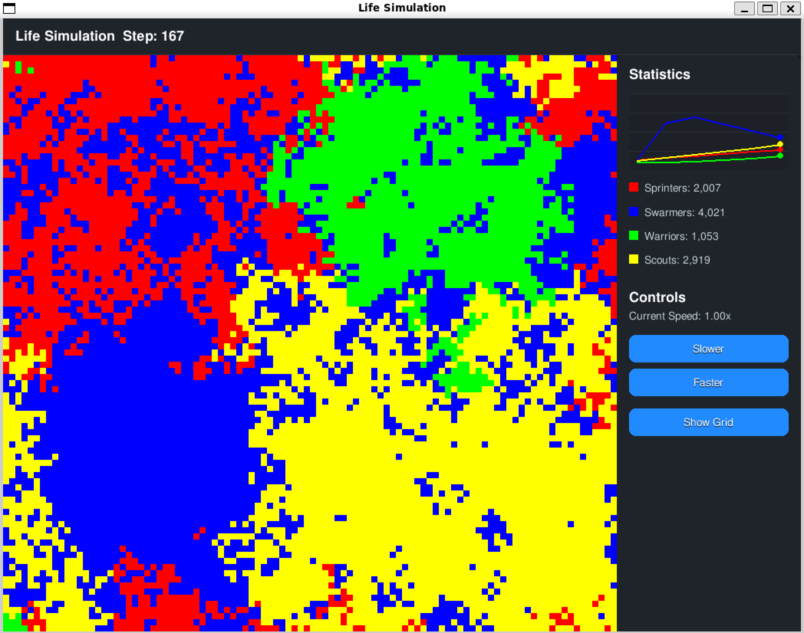

# Pixel Life Simulation

A Python-based pixel simulation of competing species in a configurable grid environment. The simulation demonstrates artificial life concepts including movement, reproduction, and competition between different species with unique characteristics and behaviors.



## Features

- Configurable grid environment
- 4 unique species with different characteristics:
  - Movement speed
  - Reproduction rate
  - Combat strength
- Real-time population statistics with interactive graph
- Modern UI with dark theme and anti-aliasing:
  - Population trends visualization
  - Gradient background
  - Smooth animations and transitions
  - Tooltips for controls
- Simulation step counter and extinction tracking:
  - Real-time step count display
  - Extinction detection and reporting
  - Historical extinction data
- Adjustable simulation speed (0.25x to 4.0x)
- Pause/Resume functionality
- Toroidal world (wrapping around edges)
- Toggleable grid lines

## Species

### Sprinters
- Fastest movement in the simulation
- Below average combat ability
- Very low reproduction rate
- Starting position: Top-left
- Strategy: Relies on superior speed to survive and find opportunities

### Swarmers
- High mobility
- Medium combat ability
- Explosive reproduction rate
- Starting position: Top-right
- Strategy: Dominates through overwhelming numbers and rapid expansion

### Warriors
- Low mobility
- Superior combat strength
- Very low reproduction rate
- Starting position: Bottom-left
- Strategy: Controls territory through combat superiority

### Scouts
- Very high mobility
- Balanced combat ability
- Low-medium reproduction rate
- Starting position: Bottom-right
- Strategy: Adaptable approach with focus on mobility

## Controls

- **Space**: Pause/Resume simulation
- **ESC**: Exit simulation
- **Speed Controls**:
  - "- Slower": Decrease simulation speed (minimum 0.25x)
  - "+ Faster": Increase simulation speed (maximum 4.0x)
- **Grid**: Toggle grid lines visibility

## Project Structure

```
.
├── src/                    # Source code directory
│   ├── simulation.py       # Main simulation logic
│   ├── grid.py            # Grid management and species behavior
│   ├── renderer.py        # Visualization and display
│   └── ui/                # UI components
│       └── button.py      # Button class implementation
├── config/                 # Configuration directory
│   ├── display.py         # Display settings
│   ├── grid.py           # Grid parameters
│   ├── simulation.py      # Simulation parameters
│   └── species.py        # Species characteristics
├── main.py                # Entry point
└── requirements.txt       # Python dependencies
```

## Configuration

The simulation parameters are organized in the `config` directory:

### Display Settings (`config/display.py`)
```python
WINDOW_SIZE = 800     # Window dimensions in pixels
STATS_UPDATE_RATE = 30  # Stats update frequency
STATS_GRAPH_HEIGHT = 100  # Height of population graph
ENABLE_ANTIALIASING = True  # Smooth graphics
SHOW_GRID = False  # Grid lines visibility
EXTINCT_COLOR = (229, 83, 75)  # Red color for extinct species
```

### Grid Settings (`config/grid.py`)
```python
GRID_SIZE = 100      # Size of the simulation grid
CELL_SIZE = 8        # Size of each cell in pixels
FRAME_RATE = 30      # Base simulation speed
```

### Species Settings (`config/species.py`)
Each species is configured with:
- `name`: Display name
- `color`: RGB color tuple
- `initial_count`: Starting population
- `movement_chance`: Probability of moving each frame (0-1)
- `reproduction_chance`: Probability of reproduction each frame (0-1)
- `combat_strength`: Relative strength in combat (0-1)
- `start_area`: Starting area coordinates (x1, y1, x2, y2)

## Combat System

Combat is resolved using relative strength values:
- When two creatures meet, their combat strengths are compared
- Victory probability = attacker_strength / (attacker_strength + defender_strength)
- Winner takes over the cell, loser is eliminated

## Requirements

- Python 3.x
- pygame
- numpy

## Installation

1. Clone the repository
2. Install the required packages:
```bash
pip install -r requirements.txt
```

## Running the Simulation

To run the simulation:
```bash
python main.py
```

## Customization

To modify the simulation:

1. Edit species characteristics in `config/species.py`:
   - Adjust movement speeds
   - Change reproduction rates
   - Modify combat strengths
   - Change starting positions and populations

2. Adjust display settings in `config/display.py`:
   - Window size
   - Statistics display
   - UI colors and fonts

3. Modify grid settings in `config/grid.py`:
   - Grid size and cell size
   - Base frame rate

4. Add new species:
   - Add a new entry to the species configuration in `config/species.py`
   - Define characteristics and starting area
   - The simulation will automatically handle the new species

## Technical Details

- Window size: 800x800 pixels + 240px control panel
- Modern dark theme with gradient background
- Interactive population graph with 100 data points history
- Real-time step counter in title bar
- Extinction tracking with step number display
- Grid size: 100x100 cells
- Cell size: 8x8 pixels
- Base frame rate: 30 FPS
- Initial population: 300-400 creatures per species 